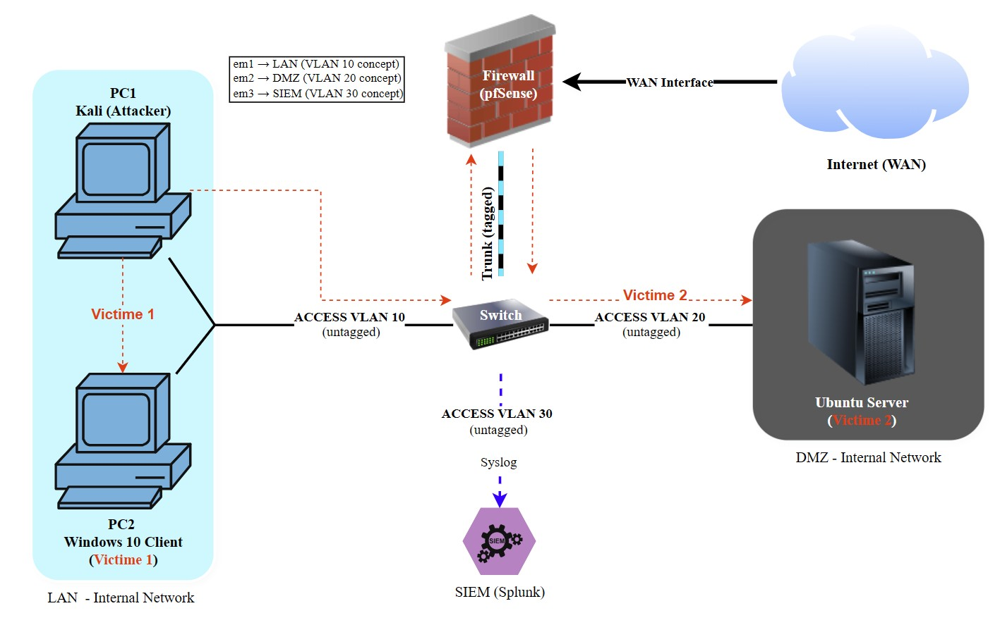

# Network Lab — SIEM Detection & Inside Threat Simulation

## Overview

I built a segmented virtual network with a working SIEM that collects logs from all endpoints in real time.

The lab simulates an insider threat scenario: an attacker on the internal LAN moves laterally across network segments while Splunk captures everything. The goal was to build something I could actually attack and defend, not just read about.

## Network Design

| Zone | Subnet | Purpose |
|---|---|---|
| LAN | 192.168.10.0/24 | Attacker + Victim 1 |
| DMZ | 192.168.20.0/24 | Victim 2 (isolated server) |
| SIEM | 192.168.30.0/24 | Splunk (log collection only) |
| WAN | 10.0.2.0/24 | Internet via NAT |

## Lab Components

- **Firewall/Router:** pfSense CE 2.7.2
- **Attacker:** Kali Linux 2025.4
- **Victim 1 (LAN):** Windows 10
- **Victim 2 (DMZ):** Ubuntu Server 24.04.3 LTS
- **SIEM:** Splunk Enterprise 10.2.1
- **Platform:** Oracle VirtualBox (24 GB RAM host)

## Diagram

## Status

Lab fully configured. All three endpoints sending logs to Splunk.  
Attack scenario in progress.

## Skills Demonstrated

- Network segmentation (LAN / DMZ / SIEM / WAN)
- Firewall deployment and rule configuration (pfSense)
- SIEM setup and log ingestion (Splunk Enterprise)
- Universal Forwarder deployment on Linux and Windows
- Routing troubleshooting across network segments
- SPL queries for event analysis

## Next Steps

- Execute inside threat attack scenario (Kali to Windows 10 to Ubuntu DMZ)
- Configure detection alerts in Splunk
- Document findings with screenshots and SPL queries