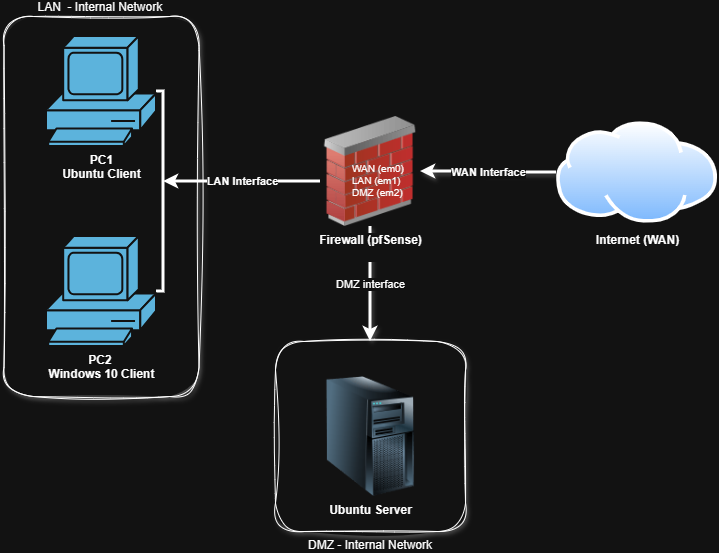

# Network Lab — pfSense Firewall & Network Segmentation

## Overview

I designed and deployed a segmented network environment using pfSense 
as the central firewall and router, with VirtualBox as the 
virtualization platform.

The lab simulates a realistic three-zone network: internal users on LAN,
an exposed service on DMZ, and simulated internet traffic on WAN — all 
controlled through a single firewall.

After completing the initial configuration, I reset everything 
deliberately. I realised I had followed steps without fully understanding 
the reasoning behind each one. I'm rebuilding it from scratch to develop 
real understanding, not just a working setup.

## Network Design

| Zone | Interface | Subnet | Purpose |
---------------------------------------------------
| WAN | em0 | DHCP (10.0.2.x) | Simulated internet |
| LAN | em1 | 192.168.1.1/24 | Internal clients |
| DMZ | em2 | 192.168.2.1/24 | Isolated server |

## Lab Components

- **Firewall/Router:** pfSense 2.7.2
- **LAN Clients:** Ubuntu Desktop, Windows 10
- **DMZ:** Ubuntu Server
- **Platform:** VirtualBox

## Diagram

## Status

Infrastructure design complete. pfSense interfaces configured.  
Currently rebuilding from scratch to develop deeper understanding 
of interface assignment, routing logic, and firewall rule behaviour.

## Skills Demonstrated

- Network segmentation (LAN / DMZ / WAN)
- Firewall deployment and interface configuration
- Virtualized lab environment design

## Next Steps

- Rebuild pfSense configuration with documented reasoning per step
- Define and test firewall rules between zones
- Document traffic flow and control decisions