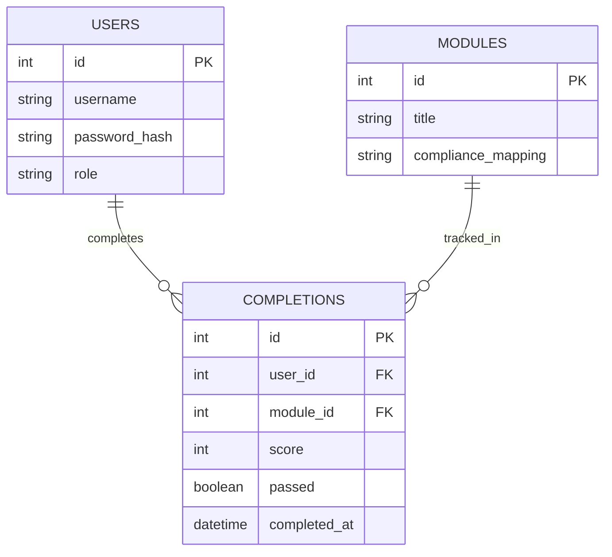

# Database Schema

## Overview

The application uses three tables in SQLite.
A completion record links a user to a module and stores the result of that attempt (score, pass/fail, and timestamp).

## Entity Relationship Diagram

## Table Notes

**USERS**
Stores login credentials and role with passwords stored as hashes.
The `role` field is included from the start so an admin view (all users completion data) can be added later.

**MODULES**
One row per training module. `compliance_mapping` stores the NIST/ISO reference directly on the module, so a compliance report can be generated with a simple join against `COMPLETIONS`, without a separate mapping table.

**COMPLETIONS**
The core tracking table. Each row represents one user completing one module, with the score achieved, whether they passed, and when. This is a many-to-many relationship between `USERS` and `MODULES`, resolved through this join table.
